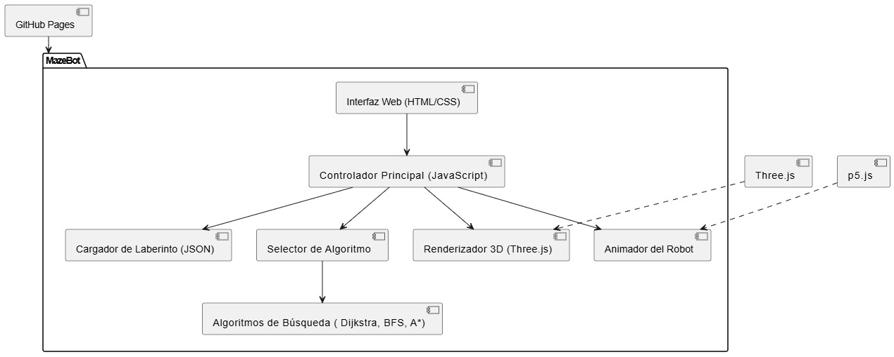
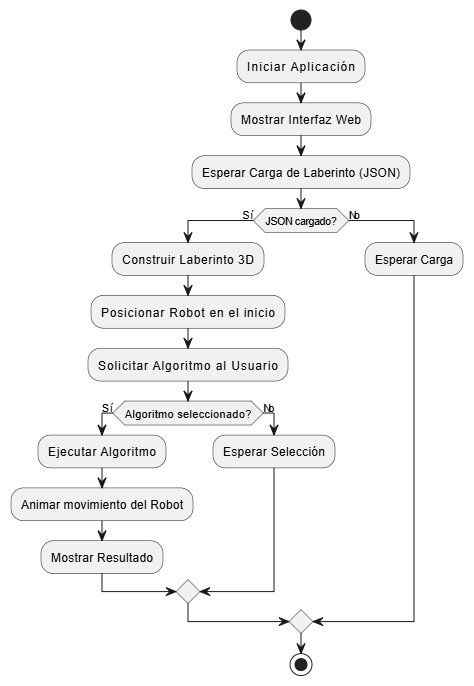
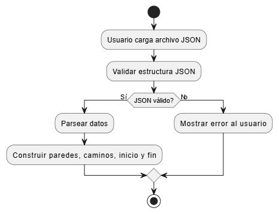
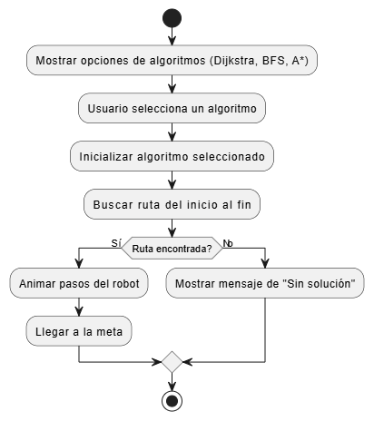

#### Universidad de San Carlos de Guatemala
#### Facultad de Ingeniería
#### Escuela de Ciencias y Sistemas
#### Inteligencia Artificial
#### Ing. LUIS FERNANDO ESPINO BARRIOS
#### Auxiliar: ROBIN OMAR BUEZO DÍAZ
<br><br><br><br><br><br><br>
<p style="text-align: center;"><strong> Proyecto 3: MazeBot <br>
</strong></p>
<br><br><br><br><br><br><br>

| Nombre                              | Carnet    |
| :---:                               |  :----:   |
| Eduardo Alexander Reyes Gonzalez    | 202010904 |
| Pedro Martin Francisco              | 201700656 |
| Luis Antonio Cutzal Chalí           | 201700841 |

# Intruducción
<p align="justify">
El presente manual técnico documenta el desarrollo del proyecto MazeBot, una aplicación web tridimensional diseñada como parte de los requerimientos del curso de Inteligencia Artificial 1 de la Universidad de San Carlos de Guatemala.
</p>
<p align="justify">
MazeBot tiene como objetivo simular el comportamiento de un robot autónomo dentro de un laberinto generado dinámicamente, permitiendo la visualización y comprensión de conceptos fundamentales de inteligencia artificial como la búsqueda de caminos y la toma de decisiones en entornos dinámicos. El proyecto utiliza tecnologías web como JavaScript, HTML, CSS, y bibliotecas de renderizado 2D/3D como p5.js y Three.js, asegurando compatibilidad con navegadores modernos sin necesidad de instalación de software adicional.
</p>
<p align="justify">
La estructura de los laberintos es definida mediante archivos JSON que contienen la configuración de muros, punto de inicio y punto de meta, permitiendo así la personalización y experimentación con distintos escenarios. El robot virtual es capaz de analizar su entorno y encontrar la mejor ruta hacia su objetivo aplicando distintos algoritmos de búsqueda, como BFS (Breadth-First Search), Dijkstra y A*.
</p>
<p align="justify">
Este manual detalla la arquitectura del sistema, los diagramas de flujo del funcionamiento, las tecnologías utilizadas, así como las decisiones técnicas que fundamentan la implementación de MazeBot. Su propósito es proporcionar una guía clara para el entendimiento, mantenimiento y futura mejora del proyecto.
</p>

# Objetivo General
<p align="justify">
Desarrollar un simulador tridimensional de un robot que resuelva de forma automática laberintos generados dinámicamente mediante configuraciones en archivos JSON, aplicando principios de inteligencia artificial, programación y simulación de comportamientos inteligentes.
</p>

# Objetivos Específicos
- Diseñar e implementar un entorno web 3D interactivo que represente la estructura del laberinto.
- Desarrollar un sistema de lectura e interpretación de laberintos definidos por archivos JSON.
- Programar un robot virtual capaz de recorrer el laberinto desde un punto inicial a uno final utilizando algoritmos de búsqueda como BFS, Dijkstra y A*.
- Facilitar la comprensión visual de la resolución de laberintos mediante animaciones paso a paso del robot.

# Enunciado del proyecto
<p align="justify">
Este proyecto tiene como objetivo el desarrollo de MazeBot, una aplicación web tridimensional
que simula un entorno de laberinto y un robot autónomo capaz de resolverlo utilizando
algoritmos de búsqueda. El sistema permitirá la carga dinámica de laberintos mediante
archivos JSON, facilitando la experimentación con diferentes configuraciones.
</p>
<p align="justify">
MazeBot está diseñado para fomentar la comprensión de conceptos de inteligencia artificial
aplicados a entornos virtuales, integrando visualización 3D, simulación de comportamientos
inteligentes y estrategias de resolución de problemas. La aplicación se desarrollará utilizando
bibliotecas como p5.js y Three.js, y será accesible desde navegadores web modernos.
</p>

# Descipcion del problema 
<p align="justify">
En el aprendizaje de la inteligencia artificial, es común que los conceptos teóricos como la
búsqueda de caminos, percepción del entorno y toma de decisiones resulten abstractos para
los estudiantes. La falta de herramientas visuales interactivas limita la comprensión de estos
procesos.
</p>
<p align="justify">
El objetivo del proyecto es construir un simulador en el que los estudiantes puedan observar
el comportamiento de un agente inteligente dentro de un laberinto generado dinámicamente.
A través de este entorno, los usuarios podrán visualizar cómo el robot analiza su entorno,
aplica un algoritmo de búsqueda y encuentra la ruta más corta hacia un objetivo.
El sistema también permitirá cargar distintos laberintos definidos en archivos JSON, lo cual
fomentará la experimentación, el diseño de escenarios personalizados y la comprensión del
impacto que tienen distintas estructuras en el rendimiento de los algoritmos.
</p>

# Descripción General del Proyecto
<p align="justify">
MazeBot es un simulador tridimensional de resolución de laberintos desarrollado por los
estudiantes del curso de Inteligencia Artificial 1 de la Universidad de San Carlos de
Guatemala. Su propósito es introducir a los estudiantes en la simulación de entornos
inteligentes, combinando elementos de lógica, visualización tridimensional y algoritmos de
búsqueda de caminos.
</p>
<p align="justify">
MazeBot permite diseñar laberintos de manera dinámica mediante archivos JSON
configurables, e implementa un robot virtual que analiza su entorno y determina la mejor ruta
desde un punto de inicio hasta una meta. El proyecto aplica conocimientos adquiridos en
programación, estructuras de datos, simulación y uso de bibliotecas como p5.js y Three.js,
consolidando la formación técnica de los estudiantes y su capacidad para construir soluciones
inteligentes visualmente atractivas.
</p>

# Arquitectura del sistema.


# Módulos del Sistema
## Módulo de Usuario
+ Carga de Laberintos: El usuario puede cargar archivos .json que definen la estructura del laberinto (ancho, alto, inicio, meta y paredes).

+ Visualización del Laberinto 3D: Renderizado dinámico del laberinto en un entorno tridimensional usando Three.js.

+ Selección de Algoritmo: El usuario puede elegir entre los algoritmos de búsqueda disponibles (BFS, Dijkstra, A*).

+ Ejecución de la Simulación: El robot virtual ejecuta la ruta calculada paso a paso.

+ Control de la Simulación: Opciones para reiniciar la animación, cambiar de algoritmo o cargar un nuevo laberinto.

## Módulo Administrativo (Backend):
+ Gestión de Laberintos: Crear, editar o validar archivos .json que describen laberintos compatibles.

+ Actualización de Algoritmos: Agregar o modificar algoritmos de búsqueda en el código fuente para experimentaciones académicas.

+ Mantenimiento de Modelos 3D: Integrar o modificar modelos y animaciones del robot utilizando Three.js y p5.js.

# Diagramas de flujo






# Componentes clave

| Componente                     | Descripción                                                        |
|---------------------------------|--------------------------------------------------------------------|
| Interfaz Web (HTML/CSS)         | Permite la interacción visual y la carga de archivos.              |
| Controlador Principal (JavaScript) | Coordina las acciones del usuario, algoritmos y renderizado.    |
| Renderizador 3D (Three.js)      | Construye el entorno tridimensional basado en los datos JSON.      |
| Animador de Robot (p5.js y Three.js) | Gestiona la animación y movimiento del robot virtual.         |
| Módulo de Algoritmos            | Implementa y ejecuta los algoritmos BFS, DFS y A*.                 |
| Cargador de Laberintos          | Valida y traduce archivos JSON en estructuras 3D.                  |

## Requisitos del Sistema
- Navegador Web actualizado (Google Chrome, Firefox, Edge).
- Conexión a Internet para acceder a GitHub Pages (si se despliega).
- Compatible con PC, Laptop o Tablet (no optimizado para dispositivos móviles pequeños).
- Recomendación mínima:
    - Procesador: Intel Core i3 o superior.
    - Memoria RAM: 4 GB mínimo.
    - Sistema operativo: Windows 10+, MacOS, o distribuciones recientes de Linux.


## Instalación del Entorno de Desarrollo
- Instalar Node.js
- Clonar el Repositorio de GitHub
- Ejecutar el Proyecto Localmente
```python
python -m http.server 8000
```
- Usa un editor de código que te ayude a escribir, depurar y organizar tu proyecto, como Visual Studio Code (VS Code)

## Estructura de carpetas
- Organiza tu proyecto en carpetas para mantener los archivos ordenados.
```json
│   index.html
│   LICENSE
│   README.md
├───animacion
│       walking.glb
├───css
│       index.css
├───img
|
├───js
│       algoritmo1.js
│       algoritmo2.js
│       algoritmo3.js
│       dibujar.js
│       emergente.js
│       index.js
│       movimiento.js
|
├───knowledge_base
│       lab1.json
│       laberinto1.json
│       laberinto2.json
│       laberinto3.json
|
├───manuales
├───────img
│       manual_tecnico.md
│       manual_usuario.md
|
└───modelos
        steve3d.glb
```

# Mantenimiento
- Versionamiento: El proyecto debe mantenerse bajo control de versiones en GitHub, siguiendo buenas prácticas de commits descriptivos y ramas de desarrollo.
- Actualizaciones:
    - Agregar nuevos algoritmos de búsqueda conforme se avanza en los temas del curso.
    - Mejorar la compatibilidad móvil o añadir nuevas animaciones al robot.

- Corrección de Errores:
    - Las actualizaciones deben corregir errores en la carga de JSON o visualización 3D.
    - Se recomienda usar issues en GitHub para documentar problemas y soluciones.

# Requerimientos Técnicos y Dependencias
- Lenguajes:
    - JavaScript (principal).
    - HTML5.
    - CSS3.

- Bibliotecas:
    - Three.js: Motor gráfico para renderizado 3D.
    - p5.js: Manejo de animaciones sencillas y canvas 2D/3D.

- Repositorios:
    - Código fuente alojado en GitHub.
    - Publicación web en GitHub Pages.
- Formato de Entrada:
    - Archivos .json estructurados correctamente:

```json
{
  "ancho": 5,
  "alto": 5,
  "inicio": [0, 0],
  "fin": [4, 4],
  "paredes": [
    [0, 1],
    [1, 1],
    [2, 1],
    [3, 1],
    [1, 3],
    [2, 3],
    [3, 3]
  ]
}
```
# Justificación de Algoritmos Seleccionados
## Dijkstra
- Motivo de elección:
    - El algoritmo de Dijkstra es reconocido por encontrar la ruta más corta en grafos ponderados o no ponderados de forma garantizada y aunque nuestro laberinto no tiene pesos diferenciados entre celdas, Dijkstra es ideal porque asegura encontrar el camino óptimo, explorando de manera sistemática todos los caminos posibles de menor costo.
- Ventajas:
    - Garantiza la ruta de costo mínimo.
    - No requiere heurística.
    - Robusto ante cualquier estructura de laberinto.
- Aplicación en MazeBot:
    - Permite demostrar un enfoque clásico de búsqueda basada en costos acumulativos, brindando un contraste importante frente a técnicas basadas en heurísticas como A*.

## BFS (Breadth-First Search)
- Motivo de elección:
    - BFS es un algoritmo de búsqueda no informada que explora primero todos los nodos a una distancia dada antes de avanzar a distancias mayores, debido a que BFS siempre encuentra la solución más corta en términos de número de pasos (en grafos no ponderados), resulta ideal para laberintos simples donde todos los movimientos tienen igual costo.

- Ventajas:
    - Sencillo de implementar y visualizar.
    - Encuentra el camino más corto basado en número de movimientos.
    - Permite observar el proceso sistemático de expansión de nodos.
- Aplicación en MazeBot:
    - Es útil para explicar el comportamiento de búsquedas exhaustivas en entornos donde cada movimiento tiene un costo uniforme.

# A* (A-Star)
- Motivo de elección:
    - A* combina lo mejor de la búsqueda por costo acumulado (como Dijkstra) y la búsqueda heurística (basada en estimaciones). Utiliza una función f(n) = g(n) + h(n), donde:
        - g(n) es el costo desde el inicio hasta el nodo n.
        - h(n) es la estimación heurística del costo restante hasta la meta.
    - Esta combinación le permite encontrar caminos óptimos de forma mucho más eficiente que Dijkstra o BFS cuando se utiliza una heurística adecuada, como la distancia Manhattan en laberintos.
- Ventajas:
    - Encuentra el camino óptimo más rápidamente que Dijkstra.
    - Permite un control flexible del comportamiento de búsqueda mediante la heurística.
    - Altamente eficiente en laberintos grandes o con caminos extensos.
- Aplicación en MazeBot:
    - Permite demostrar la eficiencia de las búsquedas heurísticas en comparación con búsquedas ciegas, favoreciendo la comprensión de técnicas modernas de inteligencia artificial.

# Estructura del archivo json 
- Lab1
```json
{
    "ancho": 5,
    "alto": 5,
    "inicio": [0, 0], 
    "fin": [4, 4], 
    "paredes": [
        [0, 1], 
        [1, 1], 
        [2, 1], 
        [3, 1], 
        [1, 3], 
        [2, 3], 
        [3, 3] 
    ]
}
```
- Laberinto 1
```json
{
    "ancho": 5,
    "alto": 5,
    "inicio": [0,0], 
    "fin": [4, 4], 
    "paredes": [
        [1,0], 
        [1,1], 
        [1,3], 
        [3,1],
        [3,2],
        [3,3]
    ]
}
```
- Laberinto 2
```json
{
    "ancho": 13,
    "alto": 15,
    "inicio": [6,9], 
    "fin": [0, 2], 
    "paredes": [
        [0,0],
        [0,1],
        [1,0],
        [1,1],
        [1,3],
        [1,4],
        [1,5],
        [1,6],
        [1,7],
        [1,8],
        [1,9],
        [1,10],
        [1,11],
        [1,12], 
        [1,13],
        [2,0],
        [2,1],
        [2,13], 
        [3,0], 
        [3,1],
        [3,2],
        [3,3],
        [3,4],
        [3,5],
        [3,6],
        [3,7],
        [3,8],
        [3,9],
        [3,10],
        [3,11],
        [3,13],
        [4,13],
        [5,1],
        [5,2],
        [5,3],
        [5,4],
        [5,5],
        [5,6],
        [5,7],
        [5,8],
        [5,9],
        [5,10],
        [5,11],
        [5,12],
        [5,13],
        [7,1],
        [7,2],
        [7,3],
        [7,4],
        [7,5],
        [7,6],
        [7,7],
        [7,8],
        [7,9],
        [7,10],
        [7,11],
        [7,12],
        [7,13],
        [8,13],
        [9,0],
        [9,1],
        [9,2],
        [9,3],
        [9,4],
        [9,5],
        [9,6],
        [9,7],
        [9,8],
        [9,9],
        [9,10],
        [9,11],
        [9,13],
        [10,0],
        [10,1],
        [10,13],
        [11,0],
        [11,1],
        [11,3],
        [11,4],
        [11,5],
        [11,6],
        [11,7],
        [11,8],
        [11,9],
        [11,10],
        [11,11],
        [11,12],
        [11,13],
        [12,0],
        [12,1]
    ]
}
```
- Laberinto 3
```json
{
  "ancho": 21,
  "alto": 21,
  "inicio": [18, 20],
  "fin": [0, 2],
  "paredes": [
    [0,0],[0,1],[0,3],[0,4],[0,5],[0,6],[0,7],[0,9],[0,11],[0,13],[0,14],[0,15],[0,16],[0,18],[0,19],[0,20],
    [1,7],[1,9],[1,11],[1,13],
    [2,0],[2,1],[2,3],[2,4],[2,5],[2,6],[2,7],[2,9],[2,11],[2,13],[2,15],[2,16],[2,17],[2,18],[2,19],
    [3,7],[3,9],[3,11],[3,13],[3,15],[3,19],
    [4,1],[4,2],[4,3],[4,4],[4,5],[4,6],[4,7],[4,9],[4,11],[4,13],[4,15],[4,17],[4,18],[4,19],
    [5,11],[5,20],
    [6,0],[6,2],[6,3],[6,4],[6,5],[6,6],[6,7],[6,8],[6,9],[6,11],[6,13],[6,14],[6,15],[6,17],[6,18],
    [7,0],[7,7],[7,9],[7,13],[7,15],[7,19],[7,20],
    [8,0],[8,1],[8,3],[8,4],[8,5],[8,6],[8,7],[8,9],[8,11],[8,13],[8,15],[8,16],[8,17],[8,19],
    [9,11],[9,13],
    [10,1],[10,2],[10,3],[10,4],[10,5],[10,6],[10,7],[10,9],[10,13],[10,14],[10,15],[10,16],[10,17],[10,19],
    [11,7],[11,9],[11,11],[11,20],
    [12,0],[12,1],[12,2],[12,3],[12,5],[12,7],[12,9],[12,11],[12,13],[12,15],[12,17],[12,19],
    [13,7],[13,9],[13,11],[13,13],[13,15],[13,17],[13,19],
    [14,0],[14,1],[14,2],[14,3],[14,5],[14,6],[14,7],[14,9],[14,10],[14,11],[14,13],[14,14],[14,15],[14,17],[14,20],
    [15,0],[15,5],[15,11],[15,15],
    [16,0],[16,1],[16,2],[16,3],[16,4],[16,5],[16,6],[16,7],[16,9],[16,11],[16,13],[16,15],[16,17],[16,18],[16,20],
    [17,7],[17,9],[17,13],[17,15],[17,17],
    [18,0],[18,1],[18,3],[18,4],[18,5],[18,6],[18,7],[18,9],[18,11],[18,13],[18,15],[18,17],[18,18],
    [19,9],[19,13],[19,20],
    [20,0],[20,1],[20,2],[20,5],[20,6],[20,7],[20,9],[20,10],[20,11],[20,13],[20,14],[20,15],[20,17],[20,18],[20,19],[20,20]
  ]
}
```