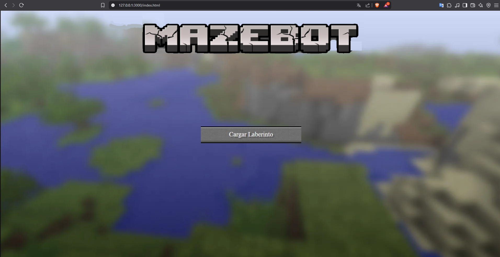

# Introducción

El presente documento tiene como objetivo proporcionar una guía de usuario para el proyecto "MazeBot". Este proyecto consiste en un robot que navega a través de un laberinto utilizando algoritmos de búsqueda y técnicas de inteligencia artificial. El robot es capaz de encontrar la salida del laberinto de manera eficiente y autónoma.

## Requisitos
Contar con un laptop, computadora o dispositivo móvil con acceso a internet. El proyecto está diseñado para ejecutarse en un entorno web, por lo que no es necesario instalar ningún software adicional. Sin embargo, se recomienda utilizar un navegador web moderno y actualizado para garantizar la mejor experiencia de usuario.

## Inicio del programa

El programa se inicia ejecutando un servidor para servir la interfaz web. 

## Cargar laberinto
Para poder cargar un laberinto, se debe seleccionar un archivo de laberinto en formato .json este tiene la información de la estructura del laberinto, incluyendo las posiciones de inicio y fin, así como los obstáculos. 

## Pantalla Cargada con el laberinto selecionado  
Cuando se carga un laberinto, se muestra en la pantalla principal. El laberinto se representa gráficamente, y el robot (personaje) se coloca en la posición de inicio. La interfaz también muestra información sobre el laberinto, como su tamaño y la posición de la salida. Ademas se muestran las opciones de los algoritmos que se pueden utilizar para resolver el laberinto. El boton de iniciar, inicia el algoritmo seleccionado y el boton Cambiar Mapa, que da la opcion de cargar otro laberinto nuevo.

## Opciones de Ver camino final
Por defecto el robot no muestra el camino final, sino cada paso que da. Si se desea ver el camino final, se debe seleccionar la opción "Ver camino final". Esto mostrará el camino completo desde la posición de inicio hasta la salida del laberinto. Esta opción es útil para visualizar la solución del laberinto y entender cómo el robot llegó a la salida.

## Finalización
Al finalizar el recorrido del laberinto, se muestra una pantalla con con la opción de reiniciar la animacion, la opción de volver a cargar otro laberinto y utilizar otro algoritmo.

